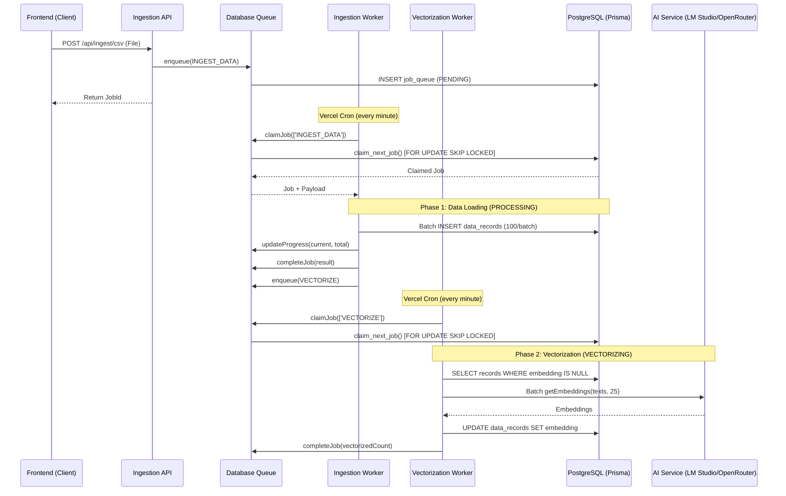

# Ingestion & Database Queue System

The tool implements a **production-ready database-backed job queue** designed for reliable, scalable data ingestion in serverless environments. The queue system ensures job persistence across deployments and enables concurrent processing with automatic retries.

## Architecture Overview

The ingestion system uses a **two-phase parallel architecture** backed by PostgreSQL:

1. **Phase 1: Data Loading** (Fast, parallel)
2. **Phase 2: Vectorization** (Slow, sequential per project)



## Process Lifecycle

### Job States

Jobs progress through the following states:

```
PENDING → PROCESSING → COMPLETED
                    ↓
                  FAILED (with retries)
```

**State Descriptions:**
- **PENDING**: Job is queued, waiting to be claimed by a worker
- **PROCESSING**: Worker is actively processing the job
- **COMPLETED**: Job finished successfully, payload cleared
- **FAILED**: Job exhausted all retry attempts

### Queue Jobs Table Schema

```sql
CREATE TABLE job_queue (
  id TEXT PRIMARY KEY,
  job_type TEXT NOT NULL,           -- 'INGEST_DATA' or 'VECTORIZE'
  status TEXT NOT NULL,              -- 'PENDING', 'PROCESSING', 'COMPLETED', 'FAILED'
  payload JSONB NOT NULL,            -- Job data (CSV records, project IDs, etc.)
  result JSONB,                      -- Result data from worker
  progress JSONB,                    -- {current, total, message}
  priority INTEGER DEFAULT 0,        -- Higher priority = processed first
  attempts INTEGER DEFAULT 0,        -- Current retry count
  max_attempts INTEGER DEFAULT 3,    -- Maximum retry attempts
  scheduled_for TIMESTAMP,           -- When job should be processed
  started_at TIMESTAMP,              -- When worker claimed the job
  completed_at TIMESTAMP,            -- When job finished
  created_at TIMESTAMP DEFAULT NOW(),
  updated_at TIMESTAMP DEFAULT NOW()
);
```

### Atomic Job Claiming

Workers use PostgreSQL's `FOR UPDATE SKIP LOCKED` to atomically claim jobs without race conditions:

```sql
CREATE OR REPLACE FUNCTION claim_next_job(worker_types TEXT[])
RETURNS TABLE (job_id TEXT, job_type TEXT, payload JSONB) AS $$
BEGIN
  RETURN QUERY
  UPDATE job_queue
  SET
    status = 'PROCESSING',
    started_at = NOW(),
    attempts = attempts + 1,
    updated_at = NOW()
  WHERE id = (
    SELECT id FROM job_queue
    WHERE status = 'PENDING'
      AND job_type = ANY(worker_types)
      AND scheduled_for <= NOW()
      AND attempts < max_attempts
    ORDER BY priority DESC, created_at ASC
    LIMIT 1
    FOR UPDATE SKIP LOCKED
  )
  RETURNING id as job_id, job_type, payload;
END;
$$ LANGUAGE plpgsql;
```

## Phase Breakdown

### Phase 1: Data Loading (INGEST_DATA jobs)

**Characteristics:**
- **Fast**: Database-bound operations (~100 records/second)
- **Parallel**: Multiple projects can load data simultaneously
- **Stateless**: No dependency on AI services

**Processing Steps:**
1. Worker claims next INGEST_DATA job
2. Parse CSV records using `processAndStore()`
3. Apply filters (keywords, content validation)
4. Detect duplicates (by task_id/uuid)
5. Categorize records (TOP_10/BOTTOM_10 detection)
6. Batch insert to `data_records` (100 records/batch)
7. Update progress metadata for UI polling
8. Mark job COMPLETED and clear payload
9. Enqueue VECTORIZE job if embeddings requested

**Performance:**
- **Batch size**: 100 records per database transaction
- **Throughput**: ~1,000 records/minute (database-limited)

### Phase 2: Vectorization (VECTORIZE jobs)

**Characteristics:**
- **Slow**: AI-bound operations (~25 records/10 seconds)
- **Sequential per project**: Only one vectorization job per project at a time
- **Resumable**: Can pick up where it left off after interruption

**Processing Steps:**
1. Worker claims next VECTORIZE job
2. Query records with `embedding IS NULL` (LIMIT 250)
3. Batch generate embeddings (25 records/batch)
4. Convert embeddings to vector format: `[0.1,0.2,...]::vector`
5. Update `data_records` with embeddings
6. Check if more records remain
7. If yes: Re-enqueue VECTORIZE job (continuation)
8. If no: Mark job COMPLETED

**Performance:**
- **Batch size**: 25 records per AI request
- **Per-job limit**: 250 records per worker invocation (60s timeout)
- **Throughput**: ~150 records/minute (AI-limited)

## Worker Architecture

### Vercel Cron Workers

Three dedicated workers run on Vercel Cron schedules:

**1. Ingestion Worker** (`/api/workers/ingestion`)
- **Schedule**: Every minute
- **Timeout**: 60 seconds (Pro plan)
- **Job Types**: `['INGEST_DATA']`
- **Max Jobs/Run**: 3 jobs
- **Authentication**: `CRON_SECRET` (required in production)

**2. Vectorization Worker** (`/api/workers/vectorization`)
- **Schedule**: Every minute
- **Timeout**: 60 seconds (Pro plan)
- **Job Types**: `['VECTORIZE']`
- **Max Jobs/Run**: 2 jobs (AI latency)
- **Authentication**: `CRON_SECRET` (required in production)

**3. Cleanup Worker** (`/api/workers/cleanup`)
- **Schedule**: Daily at 2:00 AM UTC
- **Timeout**: 60 seconds
- **Action**: Delete jobs older than 7 days
- **Authentication**: `CRON_SECRET` (required in production)

### Local Development Workers

For local development without Vercel Cron:

```bash
# Run workers in background (polls every 5 seconds)
./run-workers.sh
```

This script continuously calls worker endpoints without CRON_SECRET validation (dev mode).

## Retry & Recovery

### Automatic Retries

When a job fails, the queue automatically retries with exponential backoff:

```typescript
// Retry logic in DatabaseQueue.failJob()
if (attempts < maxAttempts) {
  const backoffSeconds = Math.min(300, Math.pow(2, attempts) * 10);
  // Set status back to PENDING with delayed scheduledFor
  status = 'PENDING'
  scheduledFor = NOW() + backoffSeconds
} else {
  // No retries left
  status = 'FAILED'
}
```

**Backoff schedule:**
- Attempt 1: 10 seconds
- Attempt 2: 20 seconds
- Attempt 3: 40 seconds
- Max: 5 minutes

### Zombie Cleanup

On server restart, the system detects and handles "zombie" jobs:

1. **PROCESSING jobs**: Automatically failed (in-memory state lost)
2. **PENDING jobs**: Safe to resume (data in database)
3. **VECTORIZING jobs**: Resumed automatically (query finds remaining records)

### Manual Recovery

Admins can manually retry failed jobs via:

```typescript
// Retry a single job
await DatabaseQueue.retryJob(jobId);

// Or via API
POST /api/admin/queue/retry?jobId=xxx
```

## Performance Characteristics

### Throughput

**Data Loading:**
- Small CSV (< 1,000 records): ~60 seconds total
- Medium CSV (1,000-10,000 records): ~10 minutes total
- Large CSV (> 10,000 records): ~1 hour total

**Vectorization:**
- 1,000 records: ~7 minutes (LM Studio local)
- 1,000 records: ~5 minutes (OpenRouter cloud)
- 10,000 records: ~70 minutes

### Concurrency

**Data Loading**: Unlimited parallel projects (database-limited)
**Vectorization**: 1 job per project (AI server protection)

### Resource Usage

**Database:**
- Queue table: ~1 KB per job
- Payload: Cleared on completion (no accumulation)
- Retention: 7 days for completed/failed jobs

**Memory:**
- Workers: Stateless (no in-memory cache)
- Payload: Stored in database JSONB

## Monitoring

### Queue Monitor UI

Access at `/admin/queue-monitor` (Manager/Admin only):

**Features:**
- Real-time queue statistics
- Recent jobs list with status
- Job retry/cancel actions
- Auto-refresh every 5 seconds

### Queue Stats API

```typescript
GET /api/admin/queue/stats

Response:
{
  "queueStats": {
    "pending": 5,
    "processing": 2,
    "completed": 1000,
    "failed": 3
  },
  "recentJobs": [...],
  "oldestPendingJob": { ... }
}
```

## Cost Considerations

### LM Studio (Local)
- **Cost**: Free (local compute)
- **Privacy**: Data never leaves machine
- **Speed**: GPU-dependent (~25 records/10s)

### OpenRouter (Cloud)
- **Cost**: ~$0.0001 per embedding (text-embedding-3-small)
- **Example**: 10,000 records = ~$1.00
- **Speed**: Network-dependent (~25 records/5s)
- **Monitoring**: Balance displayed in dashboard

## Best Practices

1. **Use LM Studio for bulk imports** to avoid embedding costs
2. **Monitor queue depth** during large imports
3. **Set CRON_SECRET** in production for security
4. **Run cleanup worker daily** to prevent table bloat
5. **Adjust batch sizes** based on AI server capacity
6. **Use keyword filtering** to reduce unnecessary vectorization
7. **Monitor OpenRouter balance** before large jobs

## Troubleshooting

### Jobs stuck in PENDING
- Check worker logs: `vercel logs` or `./run-workers.sh`
- Verify CRON_SECRET is set correctly
- Check Vercel Cron execution in dashboard

### Vectorization failing
- Verify pgvector extension is enabled: `CREATE EXTENSION vector;`
- Check AI service connectivity (LM Studio/OpenRouter)
- Review worker logs for errors
- Verify embedding column type: `vector(1536)`

### High queue depth
- Increase worker frequency (reduce cron interval)
- Increase max jobs per run
- Add more vectorization workers (if AI server allows)
- Check for failed jobs blocking the queue
