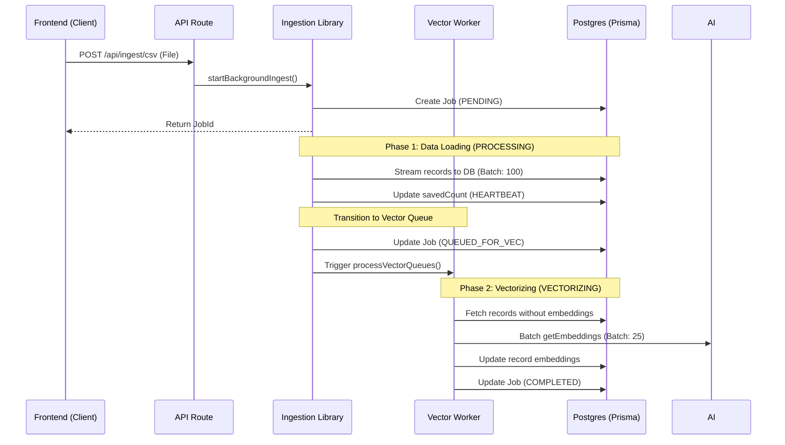

# Ingestion & Queuing Flow

The tool implements a high-performance, asynchronous, and parallelized queuing system designed to handle large datasets while maintaining a responsive UI and preventing local AI server overload.

## Process Lifecycle (Decoupled Phases)

Ingestion is split into two distinct phases to optimize for immediate data availability.

## Internal Mechanics

### 1. Parallel Execution
Unlike typical sequential queues, this system allows **Phase 1 (Data Loading)** of Job B to run while **Phase 2 (Vectorizing)** of Job A is still active.
- **Why?** Data loading is DB-bound and very fast. Vectorizing is GPU-bound and slow.
- **Result**: Users see their new records in the dashboard almost instantly, while AI enrichment happens in the background.

### 2. Multi-Stage Status Lifecycle
- **PENDING**: Job is in the project queue waiting for its turn to load data.
- **PROCESSING**: The system is currently parsing the source and saving records to PostgreSQL.
- **QUEUED_FOR_VEC**: Data is safely stored, but the AI server is currently busy with another job.
- **VECTORIZING**: The AI server is actively generating embeddings for this job.
- **COMPLETED/FAILED/CANCELLED**: Terminal states.

### 3. Queue Locking & Stability
- **Data Lock**: Only one job per project can be in `PROCESSING` at a time to ensure database write order and prevent primary key collisions.
- **AI Lock**: Only one job per project can be in `VECTORIZING` at a time to prevent overlapping requests from crashing local AI hosts (like LM Studio).

### 4. Recovery & Resumption
- **Zombie Cleanup**: On server restart, any jobs left in `PROCESSING` (where the memory payload is lost) are automatically failed.
- **Vector Resumption**: Any jobs in `QUEUED_FOR_VEC` or `VECTORIZING` can be resumed. The system scans for records missing embeddings and picks up exactly where it left off.

### 5. Performance Optimizations
- **Initial Load**: Using a `CHUNK_SIZE` of 100 for database insertions.
- **AI Batching**: We use a `BATCH_SIZE` of 25 for embeddings, significantly reducing network overhead to the local AI server.
- **Deduplication**: Every record is checked for uniqueness using `task_id` or `id` before insertion.

### 6. Cost Considerations (OpenRouter)

When using OpenRouter for embeddings:
- Each batch of 25 records incurs an API cost based on token count
- Large ingestion jobs may accumulate significant embedding costs
- Consider using LM Studio for high-volume ingestion to avoid costs
- The dashboard displays your remaining balance for monitoring
