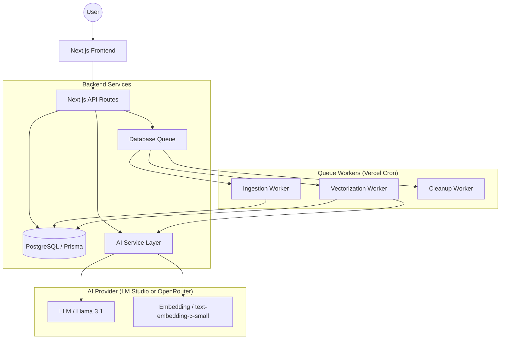

# Architectural Overview

The Operations Tools is built with a **Local-First AI** philosophy. Heavy lifting (LLM analysis and Vector Embeddings) runs on local hardware via LM Studio, ensuring data privacy and zero API costs.

## System Diagram

## Tech Stack

### Frontend
- **Framework**: Next.js 15 (App Router)
- **Styling**: Premium Glassmorphism UI (Vanilla CSS + Lucide Icons).
- **Features**: Real-time progress polling, background job management.

### Backend
- **ORM**: Prisma 7.
- **Database**: PostgreSQL (Relational data + JSON metadata + Vector arrays).
- **Processing**: Decoupled ingestion pipeline (Fast load + Async AI).

### AI Service Layer
- **Host**: Any OpenAI-compatible server (LM Studio validated, OpenRouter supported).
- **Logic**: RAG-based extraction, batch vectorization, and content sanitation.
- **Cost Tracking**: OpenRouter usage costs are captured from API responses and displayed in the UI.

## Core Data Models

1. **Project**: Organizational container holding Guidelines (PDF grounding data).
2. **DataRecord**: Individual tasks/feedback containing raw content and vector embeddings (pgvector).
3. **JobQueue**: Database-backed job queue for reliable ingestion and vectorization (new).
4. **IngestJob**: Legacy lifecycle tracker (deprecated in favor of JobQueue).
5. **BonusWindow**: Time-bounded performance tracking for collective team bonus qualification.
6. **AuditLog**: Security and compliance trail tracking all administrative and user actions across the system.
