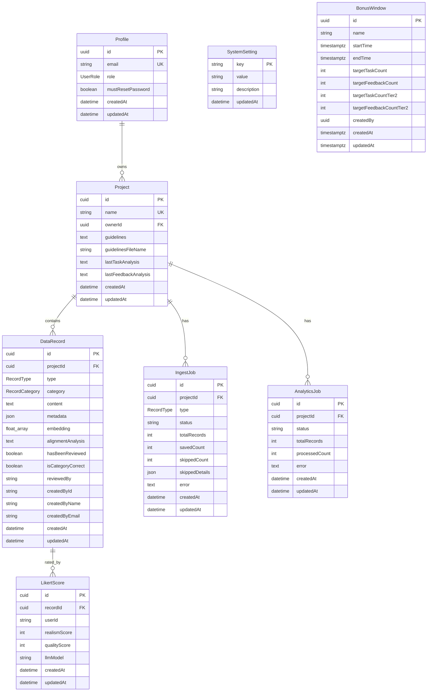

# Database Schema Reference

Complete reference for the Operations Tools database schema, including entity relationships, indexes, and constraints.

## Table of Contents

- [Overview](#overview)
- [Entity Relationship Diagram](#entity-relationship-diagram)
- [Tables](#tables)
- [Enums](#enums)
- [Indexes & Constraints](#indexes--constraints)
- [Migrations](#migrations)

---

## Overview

**Database**: PostgreSQL 15+
**ORM**: Prisma 7
**Schemas**: `public` (application), `auth` (Supabase)

### Key Features
- **Foreign Key Cascades**: Deleting a project cascades to all related records and jobs
- **JSON Metadata**: Flexible storage for custom fields from CSV imports
- **Vector Embeddings**: Float array for semantic similarity search
- **Multi-Schema**: Integrates with Supabase `auth.users` table

---

## Entity Relationship Diagram



---

## Tables

### Profile

Application-specific user metadata. Links to Supabase `auth.users` via foreign key.

| Column | Type | Constraints | Description |
|--------|------|-------------|-------------|
| `id` | UUID | PK | Matches `auth.users.id` |
| `email` | VARCHAR | UNIQUE, NOT NULL | User email address |
| `role` | UserRole | NOT NULL, DEFAULT 'PENDING' | Access level |
| `mustResetPassword` | BOOLEAN | DEFAULT false | Force password change on next login |
| `createdAt` | TIMESTAMP | NOT NULL, DEFAULT now() | Creation timestamp |
| `updatedAt` | TIMESTAMP | NOT NULL, AUTO | Last update timestamp |

**Relationships**:
- `Profile` → `Project` (one-to-many)

**Indexes**:
- Primary key on `id`
- Unique index on `email`

---

### Project

Organizational container for all data records, guidelines, and jobs.

| Column | Type | Constraints | Description |
|--------|------|-------------|-------------|
| `id` | CUID | PK | Project identifier |
| `name` | VARCHAR | UNIQUE, NOT NULL | Project name |
| `ownerId` | UUID | FK → Profile | Project owner |
| `guidelines` | TEXT | NULLABLE | Base64-encoded PDF for RAG |
| `guidelinesFileName` | VARCHAR | NULLABLE | Original filename |
| `lastTaskAnalysis` | TEXT | NULLABLE | Cached AI summary |
| `lastFeedbackAnalysis` | TEXT | NULLABLE | Cached AI summary |
| `createdAt` | TIMESTAMP | NOT NULL, DEFAULT now() | Creation timestamp |
| `updatedAt` | TIMESTAMP | NOT NULL, AUTO | Last update timestamp |

**Relationships**:
- `Project` → `DataRecord` (one-to-many, cascade delete)
- `Project` → `IngestJob` (one-to-many, cascade delete)
- `Project` → `AnalyticsJob` (one-to-many, cascade delete)

**Indexes**:
- Primary key on `id`
- Unique index on `name`
- Foreign key index on `ownerId`

---

### DataRecord

Core data unit containing task/feedback content and vector embeddings.

| Column | Type | Constraints | Description |
|--------|------|-------------|-------------|
| `id` | CUID | PK | Record identifier |
| `projectId` | CUID | FK → Project, NOT NULL | Parent project |
| `type` | RecordType | NOT NULL | TASK or FEEDBACK |
| `category` | RecordCategory | NULLABLE | TOP_10 or BOTTOM_10 |
| `source` | VARCHAR | NOT NULL | Origin (e.g., "csv:data.csv") |
| `content` | TEXT | NOT NULL | Main text content |
| `metadata` | JSONB | NULLABLE | Original CSV fields |
| `embedding` | FLOAT[] | NOT NULL, DEFAULT [] | Vector for similarity |
| `alignmentAnalysis` | TEXT | NULLABLE | AI-generated analysis |
| `hasBeenReviewed` | BOOLEAN | DEFAULT false | Human review status |
| `isCategoryCorrect` | BOOLEAN | NULLABLE | Reviewer agreement |
| `reviewedBy` | VARCHAR | NULLABLE | Reviewer identifier |
| `createdById` | VARCHAR | NULLABLE | User ID at creation |
| `createdByName` | VARCHAR | NULLABLE | User name at creation |
| `createdByEmail` | VARCHAR | NULLABLE | User email at creation |
| `ingestJobId` | CUID | NULLABLE | Source ingestion job |
| `createdAt` | TIMESTAMP | NOT NULL, DEFAULT now() | Creation timestamp |
| `updatedAt` | TIMESTAMP | NOT NULL, AUTO | Last update timestamp |

**Relationships**:
- `DataRecord` → `Project` (many-to-one)
- `DataRecord` → `LikertScore` (one-to-many, cascade delete)

**Indexes**:
- Primary key on `id`
- Foreign key index on `projectId`
- Index on `type` for filtering
- Index on `category` for filtering
- Composite index on `(projectId, type, category)` for common queries

**Notes**:
- `embedding` is used for cosine similarity searches
- `metadata` stores all original CSV columns as JSON
- Empty embeddings `[]` indicate vectorization pending

---

### IngestJob

Tracks background data ingestion processes with real-time progress.

| Column | Type | Constraints | Description |
|--------|------|-------------|-------------|
| `id` | CUID | PK | Job identifier |
| `projectId` | CUID | FK → Project, NOT NULL | Target project |
| `type` | RecordType | NOT NULL | TASK or FEEDBACK |
| `status` | VARCHAR | NOT NULL, DEFAULT 'PENDING' | Job status |
| `totalRecords` | INT | DEFAULT 0 | Expected record count |
| `savedCount` | INT | DEFAULT 0 | Successfully saved |
| `skippedCount` | INT | DEFAULT 0 | Skipped (duplicates, etc.) |
| `skippedDetails` | JSONB | NULLABLE | Breakdown by skip reason |
| `error` | TEXT | NULLABLE | Error message if failed |
| `createdAt` | TIMESTAMP | NOT NULL, DEFAULT now() | Creation timestamp |
| `updatedAt` | TIMESTAMP | NOT NULL, AUTO | Last update timestamp |

**Status Lifecycle**:
1. `PENDING` - Job created, queued
2. `PROCESSING` - Loading data into database
3. `QUEUED_FOR_VEC` - Waiting for AI vectorization
4. `VECTORIZING` - Generating embeddings
5. `COMPLETED` - Successfully finished
6. `FAILED` - Error occurred
7. `CANCELLED` - User cancelled

**Relationships**:
- `IngestJob` → `Project` (many-to-one, cascade delete)

**Indexes**:
- Primary key on `id`
- Foreign key index on `projectId`
- Index on `status` for queue management

---

### AnalyticsJob

Tracks bulk alignment analysis jobs for entire projects.

| Column | Type | Constraints | Description |
|--------|------|-------------|-------------|
| `id` | CUID | PK | Job identifier |
| `projectId` | CUID | FK → Project, NOT NULL | Target project |
| `status` | VARCHAR | NOT NULL, DEFAULT 'PENDING' | Job status |
| `totalRecords` | INT | DEFAULT 0 | Records to process |
| `processedCount` | INT | DEFAULT 0 | Records completed |
| `error` | TEXT | NULLABLE | Error message if failed |
| `createdAt` | TIMESTAMP | NOT NULL, DEFAULT now() | Creation timestamp |
| `updatedAt` | TIMESTAMP | NOT NULL, AUTO | Last update timestamp |

**Status Values**: `PENDING`, `PROCESSING`, `COMPLETED`, `FAILED`, `CANCELLED`

**Relationships**:
- `AnalyticsJob` → `Project` (many-to-one, cascade delete)

**Indexes**:
- Primary key on `id`
- Foreign key index on `projectId`

---

### SystemSetting

Key-value store for dynamic system configuration.

| Column | Type | Constraints | Description |
|--------|------|-------------|-------------|
| `key` | VARCHAR | PK | Setting key |
| `value` | VARCHAR | NOT NULL | Setting value |
| `description` | VARCHAR | NULLABLE | Human-readable description |
| `updatedAt` | TIMESTAMP | NOT NULL, AUTO | Last update timestamp |

**Common Keys**:
- `ai_provider` - "lmstudio" or "openrouter"
- `ai_host` - AI service base URL
- `llm_model` - LLM model identifier
- `embedding_model` - Embedding model identifier
- `openrouter_key` - OpenRouter API key (encrypted)

**Indexes**:
- Primary key on `key`

---

### BonusWindow

Time-bounded performance tracking for team bonus qualification.

| Column | Type | Constraints | Description |
|--------|------|-------------|-------------|
| `id` | UUID | PK | Window identifier |
| `name` | VARCHAR | DEFAULT 'Bonus Window' | Display name |
| `startTime` | TIMESTAMPTZ | NOT NULL | Window start time |
| `endTime` | TIMESTAMPTZ | NOT NULL | Window end time |
| `targetTaskCount` | INT | DEFAULT 0 | Tier 1 task target |
| `targetFeedbackCount` | INT | DEFAULT 0 | Tier 1 feedback target |
| `targetTaskCountTier2` | INT | DEFAULT 0 | Tier 2 task target |
| `targetFeedbackCountTier2` | INT | DEFAULT 0 | Tier 2 feedback target |
| `createdBy` | UUID | NOT NULL | Admin who created window |
| `createdAt` | TIMESTAMPTZ | NOT NULL, DEFAULT now() | Creation timestamp |
| `updatedAt` | TIMESTAMPTZ | NOT NULL, AUTO | Last update timestamp |

**Notes**:
- Targets of 0 disable that metric
- Users must meet BOTH task and feedback targets for tier qualification

**Indexes**:
- Primary key on `id`
- Index on `(startTime, endTime)` for time-range queries

---

### LikertScore

User or LLM ratings for records on Realism and Quality scales (1-7).

| Column | Type | Constraints | Description |
|--------|------|-------------|-------------|
| `id` | CUID | PK | Score identifier |
| `recordId` | CUID | FK → DataRecord, NOT NULL | Rated record |
| `userId` | VARCHAR | NOT NULL | User or LLM UUID |
| `realismScore` | INT | NOT NULL | 1-7 scale |
| `qualityScore` | INT | NOT NULL | 1-7 scale |
| `llmModel` | VARCHAR | NULLABLE | LLM model name if AI rating |
| `createdAt` | TIMESTAMP | NOT NULL, DEFAULT now() | Creation timestamp |
| `updatedAt` | TIMESTAMP | NOT NULL, AUTO | Last update timestamp |

**Special Values**:
- `userId = '00000000-0000-0000-0000-000000000000'` indicates LLM evaluation
- `llmModel` contains model name (e.g., "gpt-4", "claude-3")

**Relationships**:
- `LikertScore` → `DataRecord` (many-to-one, cascade delete)

**Indexes**:
- Primary key on `id`
- Index on `recordId` for record lookups
- Index on `userId` for user lookups
- Index on `llmModel` for LLM analysis

---

## Enums

### UserRole

User access levels.

```typescript
enum UserRole {
  PENDING  // Awaiting admin approval
  USER     // Standard user (read & analyze)
  MANAGER  // Team manager (+ time tracking)
  ADMIN    // Administrator (+ user management, settings)
}
```

### RecordType

Type of data record.

```typescript
enum RecordType {
  TASK      // Prompt, request, or task
  FEEDBACK  // Human or AI feedback on a task
}
```

### RecordCategory

Quality classification.

```typescript
enum RecordCategory {
  TOP_10     // High quality, well-aligned
  BOTTOM_10  // Low quality, poorly-aligned
}
```

---

## Indexes & Constraints

### Primary Keys
- All use CUID for application tables (sortable, collision-resistant)
- UUID for Supabase integration tables (`Profile`, `BonusWindow`)

### Foreign Keys
- All foreign keys have cascade delete behavior
- Deleting a `Project` cascades to all related records and jobs
- Deleting a `DataRecord` cascades to all related Likert scores

### Unique Constraints
- `Profile.email` - One account per email
- `Project.name` - Unique project names
- `SystemSetting.key` - One value per setting key

### Indexes for Performance
```sql
-- Profile lookups
CREATE INDEX idx_profile_email ON profiles(email);

-- Project queries
CREATE INDEX idx_project_owner ON projects(ownerId);

-- DataRecord filtering (most common queries)
CREATE INDEX idx_record_project ON data_records(projectId);
CREATE INDEX idx_record_type ON data_records(type);
CREATE INDEX idx_record_category ON data_records(category);
CREATE INDEX idx_record_composite ON data_records(projectId, type, category);

-- Job management
CREATE INDEX idx_ingest_job_project ON ingest_jobs(projectId);
CREATE INDEX idx_ingest_job_status ON ingest_jobs(status);
CREATE INDEX idx_analytics_job_project ON analytics_jobs(projectId);

-- Likert scores
CREATE INDEX idx_likert_record ON likert_scores(recordId);
CREATE INDEX idx_likert_user ON likert_scores(userId);
CREATE INDEX idx_likert_model ON likert_scores(llmModel);

-- Bonus windows
CREATE INDEX idx_bonus_window_time ON bonus_windows(startTime, endTime);
```

---

## Migrations

### Management Strategy Overview

The project uses **different schema management strategies** for each environment:

| Environment | Schema Files | Management Tool | Database |
|-------------|--------------|-----------------|----------|
| **Local Dev** | `supabase/migrations/*.sql` | Supabase CLI | Local Supabase |
| **Docker** | `supabase/setup.sql` | psql | Plain PostgreSQL |
| **Production** | `supabase/setup.sql` or migrations | Supabase Dashboard | Supabase Cloud |

**Division of Responsibility**:
- **Supabase manages**: Auth schema (`auth.users`, `public.profiles`, RLS policies, triggers)
- **Prisma provides**: Type-safe database access and schema documentation (READ-ONLY)

**IMPORTANT**: Prisma is used for type-safe queries, NOT for migrations.

---

### Local Development (Supabase CLI)

**Schema Files**: `supabase/migrations/*.sql`

**Workflow**:
```bash
# 1. Start Supabase (applies all migrations automatically)
npm run dev:supabase

# 2. Make schema changes in Supabase Studio

# 3. Generate migration
supabase db diff -f migration_name

# 4. Review generated SQL
cat supabase/migrations/[timestamp]_migration_name.sql

# 5. Apply migration (restart resets DB)
npm run dev:reset

# 6. Update Prisma schema if needed
# Edit prisma/schema.prisma

# 7. Regenerate Prisma Client
npm run postinstall
```

**Advantages**:
- Full version control of schema changes
- Automatic migration application
- Rollback support
- Development-friendly workflow

**Directory Structure**:
```
supabase/
├── config.toml          # Local Supabase config
├── migrations/          # Created by supabase start
│   └── 20240101000000_init_schema.sql
├── setup.sql           # Not used by local dev
└── .branches/          # Local state (gitignored)
```

---

### Docker Deployment

**Schema File**: `supabase/setup.sql` (single file)

**Workflow**:
```bash
# 1. Start Docker Compose
cd docker
docker-compose up -d

# Schema is applied automatically:
# - PostgreSQL starts
# - Runs supabase/setup.sql (creates auth schema, profiles, RLS)
# - Migration service generates Prisma Client
# - App starts and Prisma creates application tables
```

**Advantages**:
- Simple, single-file setup
- No dependencies on Supabase CLI
- Easy to understand and modify
- Faster container startup

**Why Not Migrations?**:
- Would need to copy migrations from local to git
- More complex orchestration
- Docker is for simple deployments, not active development

**Directory Structure**:
```
supabase/
├── setup.sql           # ✅ Used by Docker
├── config.toml         # Not used by Docker
└── migrations/         # Not used by Docker
```

---

### Production (Supabase Cloud)

**Schema Files**: `supabase/setup.sql` or migrations

**Workflow - Option 1 (Dashboard)**:
```bash
# 1. Go to SQL Editor in Supabase Dashboard
# 2. Copy contents of supabase/setup.sql
# 3. Run the SQL
```

**Workflow - Option 2 (CLI)**:
```bash
# Push local migrations to production
supabase db push --project-ref your-project-ref

# Or deploy specific migration
supabase db push --include-all
```

**How It Works**:
1. Supabase Cloud provides `auth.users`
2. You run `setup.sql` to create profiles table and RLS policies
3. App deploys to Vercel
4. Prisma creates application tables on first run

**Advantages**:
- Full control over timing
- Can review before applying
- Works with Supabase Cloud features
- No automatic changes

---

### Schema Components

#### 1. Auth Schema (Supabase)

**File**: `supabase/setup.sql`

**Contains**:
- `auth.users` table (managed by Supabase)
- `UserRole` enum (PENDING, USER, MANAGER, ADMIN)
- `public.profiles` table (links to auth.users)
- Row Level Security (RLS) policies
- Helper functions (e.g., `is_admin()`)
- Triggers for auto-profile creation

**Used by**:
- ✅ Docker (`docker-compose.yml`)
- ✅ Production (manual SQL editor or Supabase CLI)
- ❌ Local Dev (uses migrations instead)

#### 2. Application Schema (Prisma)

**File**: `prisma/schema.prisma`

**Contains**:
- `projects` table
- `data_records` table
- `ingest_jobs` table
- `analytics_jobs` table
- `system_settings` table
- `bonus_windows` table
- `likert_scores` table

**Management**:
- Created automatically by Prisma on first run
- Schema defined in `prisma/schema.prisma` for type safety
- Same across all environments
- **Prisma does NOT create migrations** - it only provides types

---

### Schema Updates

When modifying the schema:

1. **Update Prisma Schema** (for types)
   ```bash
   # Edit prisma/schema.prisma
   ```

2. **Generate Migration** (Local Supabase)
   ```bash
   supabase db diff -f migration_name
   ```

3. **Apply Migration** (Local)
   ```bash
   npm run dev:reset  # Resets local DB and runs all migrations
   ```

4. **Update Prisma Client**
   ```bash
   npm run postinstall  # Regenerates Prisma client
   ```

5. **Update Docker** (if auth schema changed)
   ```bash
   # Update supabase/setup.sql
   docker-compose down -v
   docker-compose up -d
   ```

6. **Production Deploy**
   - Run migration SQL in Supabase Dashboard
   - OR use `supabase db push` with Supabase CLI

### Common Migration Patterns

**Adding a Column**:
```sql
ALTER TABLE data_records
ADD COLUMN new_field VARCHAR(255);
```

**Adding an Index**:
```sql
CREATE INDEX idx_data_records_new_field
ON data_records(new_field);
```

**Adding a Foreign Key**:
```sql
ALTER TABLE data_records
ADD CONSTRAINT fk_record_user
FOREIGN KEY (userId) REFERENCES profiles(id)
ON DELETE SET NULL;
```

---

## Query Optimization Tips

### Use Composite Indexes
```typescript
// Efficient: Uses idx_record_composite
await prisma.dataRecord.findMany({
  where: {
    projectId: 'xyz',
    type: 'TASK',
    category: 'TOP_10'
  }
});
```

### Avoid SELECT *
```typescript
// Efficient: Only fetch needed fields
await prisma.dataRecord.findMany({
  select: {
    id: true,
    content: true,
    category: true
  }
});
```

### Paginate Large Queries
```typescript
// Efficient: Use cursor-based pagination
await prisma.dataRecord.findMany({
  take: 20,
  skip: offset,
  orderBy: { createdAt: 'desc' }
});
```

### Use Transactions
```typescript
// Atomic: All-or-nothing operation
await prisma.$transaction([
  prisma.project.create({ data: projectData }),
  prisma.dataRecord.createMany({ data: recordsData })
]);
```

---

## Backup & Restore

### Local Supabase
```bash
# Backup
supabase db dump -f backup.sql

# Restore
supabase db reset --db-url <connection-string>
psql <connection-string> < backup.sql
```

### Production (Supabase Cloud)
- Automatic daily backups (retained 7 days)
- Manual backups via Supabase Dashboard
- Point-in-time recovery available on paid plans

---

---

## Schema Sync Checklist

When making schema changes, ensure consistency across environments:

- [ ] **Local Dev**: Changes reflected in `supabase/migrations/`
- [ ] **Docker**: Update `supabase/setup.sql` if auth schema changed
- [ ] **Production**: Apply migration via Supabase Dashboard or CLI
- [ ] **Prisma**: Run `prisma db pull` if database schema changed
- [ ] **Prisma Client**: Run `npm run postinstall` to regenerate types
- [ ] **Git**: Commit migration files (optional for Docker)

---

## Git Configuration

### What's in Git

✅ **Committed**:
- `supabase/setup.sql` - Auth setup for Docker/Production
- `supabase/config.toml` - Local Supabase config
- `supabase/seed.sql` - Seed data for local dev
- `supabase/migrations/` - Schema migrations (optional)
- `prisma/schema.prisma` - Prisma schema for types

❌ **Not Committed** (gitignored):
- `supabase/.branches/` - Local Supabase state
- `supabase/.temp/` - Temporary files

### Prisma vs Supabase

- **Supabase manages**: Auth schema (`auth.users`, `profiles`, RLS policies, triggers)
- **Prisma manages**: Application schema (`projects`, `data_records`, etc.)
- **Both work together**: Profiles references `auth.users` via foreign key

### Schema Conflicts

If Prisma and Supabase both try to manage the same table:
- ⚠️ Conflicts can occur
- ✅ Solution: Use Supabase for auth, Prisma for app tables
- ✅ Don't put auth tables in Prisma schema

---

## Related Documentation

- [API Reference](./API_REFERENCE.md) - REST API endpoints using this schema
- [Architecture Overview](../Architecture/OVERVIEW.md) - System design
- [Testing Guide](../TESTING.md) - Database testing practices
- [Local Development Guide](../LOCAL_DEVELOPMENT.md) - Setting up local environment
- [Supabase Documentation](https://supabase.com/docs) - Supabase reference
- [Prisma Documentation](https://www.prisma.io/docs) - Prisma reference
